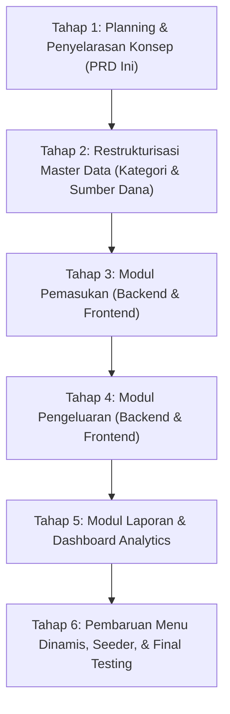

# Planning 01: Perubahan Konsep Arsitektur Castra (Master, Pemasukan, Pengeluaran, Laporan)

**Tanggal:** 2026-10-03  
**Nomor Dokumen:** 2026-10-03-01  
**Status:** SELESAI (COMPLETED)  
**Fokus:** Perubahan Konsep Inti Aplikasi dari Berbasis Pengeluaran Sempit Menjadi 4 Pilar Fungsional Keuangan

---

## 1. Latar Belakang & Alasan Perubahan

### 1.1 Kondisi Saat Ini (Legacy / Current Concept)
Sebelumnya, aplikasi dirancang sangat terikat dengan workbook referensi awal (`docs/Keuangan_September_2026.xlsx`) yang berorientasi pada:
- Estimasi pembagian persentase amplop anggaran (50% Need, 30% Fun, 20% Saving).
- Pemasukan hanya dipandang sebagai "pemicu perhitungan persentase alokasi".
- Transaksi harian berfokus pada pengeluaran terhadap alokasi anggaran bulanan.
- Halaman transaksi dan ringkasan bercampur di bawah menu `Keuangan` (`Pemasukan`, `Rincian Transaksi`, `Rencana Bulanan`, `Ringkasan Bulanan`).

### 1.2 Masalah Konsep Lama
1. **Kurang Intuitif untuk Pengelolaan Sehari-hari**: Pengguna keuangan pribadi membutuhkan alur yang natural: melihat data referensi (Master), mencatat uang masuk (Pemasukan), mencatat uang keluar (Pengeluaran), dan mengevaluasi kesehatan finansial (Laporan).
2. **Pemasukan Belum Mandiri**: Pemasukan tidak memiliki ruang kelola komprehensif tersendiri dengan riwayat detail, filter sumber, dan analitik mandiri.
3. **Pengeluaran Tercampur**: Pengeluaran disatukan dalam "Rincian Transaksi" bersama pemasukan dengan skema minus/plus yang membuat filtrasi dan analitik kategori menjadi kurang fokus.
4. **Laporan Belum Terstruktur**: Belum ada modul khusus laporan yang dapat menghasilkan Laporan Arus Kas (Cash Flow), Laporan Tren, dan Breakdown Pengeluaran per Kategori yang siap dianalisis.

### 1.3 Konsep Baru: 4 Pilar Fungsional
Aplikasi Castra akan disusun ulang secara bertahap dan terstruktur menjadi 4 pilar utama:
```text
┌─────────────────────────────────────────────────────────────┐
│                       CASTRA SYSTEM                         │
├──────────────┬──────────────┬───────────────┬───────────────┤
│   1. MASTER  │ 2. PEMASUKAN │ 3.PENGELUARAN │  4. LAPORAN   │
└──────────────┴──────────────┴───────────────┴───────────────┘
```
1. **Master**: Pondasi data referensi (Kategori Pemasukan & Pengeluaran, Sumber Dana / Akun Finansial, Alokasi Anggaran/Budget jika digunakan).
2. **Pemasukan**: Modul mandiri pencatatan, pemantauan, dan riwayat seluruh transaksi masuk.
3. **Pengeluaran**: Modul mandiri pencatatan, pemantauan, dan riwayat seluruh transaksi keluar per kategori.
4. **Laporan**: Modul analitik dan rekapitulasi data (Arus Kas, Laporan per Kategori, Realisasi Anggaran, Tren Bulanan & Tahunan).

---

## 2. Struktur Menu & Navigasi Baru

Menu navigasi dinamis berbasis role di sidebar akan diperbarui menjadi:

```text
├── Dashboard                 (Ringkasan KPI, saldo kas, widget cepat)
│
├── Master
│   ├── Sumber Dana / Akun    (Kelola asal dana/rekening/dompet)
│   ├── Kategori              (Kelola pos kategori Pemasukan & Pengeluaran)
│   └── Alokasi Anggaran      (Konfigurasi target/amplop budget bulanan)
│
├── Pemasukan
│   ├── Daftar Pemasukan      (Tabel riwayat, filter tanggal & sumber dana)
│   └── Tambah Pemasukan      (Form pencatatan nominal, tanggal, sumber, catatan)
│
├── Pengeluaran
│   ├── Daftar Pengeluaran    (Tabel riwayat, filter tanggal, kategori, status)
│   └── Tambah Pengeluaran    (Form pencatatan nominal, tanggal, kategori, catatan)
│
├── Laporan
│   ├── Arus Kas (Cash Flow)  (Perbandingan Pemasukan vs Pengeluaran per periode)
│   ├── Per Kategori          (Breakdown pengeluaran per pos kategori & chart)
│   ├── Realisasi Anggaran    (Perbandingan Budget vs Realisasi aktual)
│   └── Tren Bulanan          (Grafik historis pertumbuhan saldo dan pengeluaran)
│
└── Setup                     (Administrasi: Profil Perusahaan, Pengguna, Role, Menu)
```

---

## 3. Desain Model Data & Database (Standarisasi Prefix)

Untuk memastikan kerapian arsitektur dan isolasi domain yang jelas, seluruh tabel database keuangan mengadopsi prefix standar berikut:

| Prefix | Domain | Deskripsi & Contoh Tabel |
| --- | --- | --- |
| **`ms_`** | **Master** | Master referensi: `ms_income_sources`, `ms_categories`, `ms_budget_groups` |
| **`in_`** | **Pemasukan** | Entitas & transaksi masuk: `in_transactions` |
| **`out_`** | **Pengeluaran** | Entitas & transaksi keluar: `out_transactions` |
| **`rpt_`** | **Laporan / Rekap** | Agregasi & ringkasan: `rpt_monthly_summaries` |
| *(Core)* | **Sistem & Admin** | Tabel bawaan otentikasi: `users`, `roles`, `menus`, `role_menus`, `companies` |

### 3.1 Entitas Master (`ms_`)
1. **`ms_income_sources` (Master Sumber Dana)**
   - Kolom: `id`, `user_id`, `name`, `description`, `is_active`, timestamps.
   - Peran: Menyimpan asal dana pemasukan (Gaji, Freelance, Bonus, Dividen, dll.) atau rekening/dompet.
2. **`ms_categories` (Master Kategori)**
   - Kolom: `id`, `user_id`, `name`, `type` (`enum('income', 'expense')`), `budget_group_id` (nullable), `monthly_estimate`, `is_active`, timestamps.
   - Peran: Mengelompokkan pos transaksi belanja atau pos penerimaan.
3. **`ms_budget_groups` (Master Kelompok Anggaran - Opsional / Pendukung)**
   - Kolom: `id`, `user_id`, `code`, `name`, `percentage`, `sort_order`, `is_system`, `is_active`, timestamps.
   - Peran: Menyimpan pembagian anggaran bulanan (Need, Fun, Saving, Emergency).

### 3.2 Entitas Pemasukan (`in_`)
1. **`in_transactions` (Transaksi Pemasukan)**
   - Kolom: `id`, `user_id`, `income_source_id`, `category_id` (nullable), `amount`, `transaction_date`, `notes`, timestamps.
   - Aturan: `amount` bernilai positif, relasi ke sumber dana terverifikasi per user.

### 3.3 Entitas Pengeluaran (`out_`)
1. **`out_transactions` (Transaksi Pengeluaran)**
   - Kolom: `id`, `user_id`, `category_id`, `amount`, `transaction_date`, `notes`, timestamps.
   - Aturan: `amount` bernilai positif (secara domain mewakili dana keluar), relasi ke kategori `type = 'expense'`.

### 3.4 Entitas Laporan & Ringkasan (`rpt_`)
1. **`rpt_monthly_summaries` (Ringkasan Bulanan)**
   - Kolom: `id`, `user_id`, `year`, `month`, `total_income`, `total_expense`, `net_balance`, timestamps.
   - Di-update secara idempoten setiap ada perubahan pada transaksi pemasukan (`in_transactions`) atau pengeluaran (`out_transactions`).
2. **Service Agregasi Real-Time**:
   - Menghitung breakdown per kategori, perbandingan budget vs aktual, dan arus kas multi-bulan langsung dari data transaksi aktual.

---

## 4. Desain Antarmuka Pengguna (Frontend UI/UX)

Mengikuti pola CoreUI 5 yang sudah ada:
Mengikuti arsitektur SPA React 19 dan CoreUI 5, antarmuka distandarisasi ke dalam 3 pola layout utama:

### 4.1 Pola 1: Default Template (Split Layout: Tabel Kiri + Form Kanan)
Digunakan sebagai template standar untuk modul **Master** dan menu operasional umum:
- **Kolom Kiri (`col-lg-7` / `col-lg-8`)**: Grid Table Data (pencarian, filter, daftar baris dengan tombol aksi Edit & Hapus, pagination).
- **Kolom Kanan (`col-lg-5` / `col-lg-4`)**: Form Input / Edit (pengguna dapat langsung menambah data baru atau mengedit data yang dipilih tanpa modal terpisah atau reload halaman).
- **Penerapan**: Master Sumber Dana (`/master/income-sources`), Master Kategori (`/master/categories`), dan Master Alokasi Anggaran (`/master/budget-groups`).

### 4.2 Pola 2: Menu Khusus Transaksi (Konsep Kalender + Modal Form)
Digunakan khusus untuk modul **Pemasukan** dan **Pengeluaran**:
- **Tampilan Kalender Penuh (Monthly Calendar Grid)**:
  - Navigasi bulan/tahun di toolbar atas.
  - Setiap sel tanggal memperlihatkan indikator atau total nominal transaksi (hijau untuk pemasukan, merah untuk pengeluaran).
  - **Interaksi Klik Hari**: Mengklik hari/tanggal membuka **Modal Form Input** dengan tanggal yang otomatis terisi sesuai hari yang diklik.
  - Modal juga menyajikan riwayat transaksi hari tersebut jika sudah ada data, dengan opsi tambah, edit, atau hapus.
  - Tersedia opsi toggle view untuk beralih antara "Tampilan Kalender" dan "Tampilan Tabel List".
- **Penerapan**: Modul Pemasukan (`src/views/incomes/`) dan Modul Pengeluaran (`src/views/expenses/`).

### 4.3 Pola 3: Menu Laporan (Top Row Filter Bar + Bottom Row Full 12-Col Table Grid)
Digunakan khusus untuk modul **Laporan**:
- **Row Atas**: Panel Filter ringkas (Pilihan Periode, Rentang Tanggal Mulai-Selesai, Filter Kategori/Sumber Dana, tombol Terapkan Filter, dan tombol Ekspor PDF/Excel).
- **Row Bawah**: Full 12 Column (`col-12`) untuk Grid Table data laporan yang luas dan lengkap, dilengkapi total akumulasi/ringkasan di bagian bawah tabel.
- **Penerapan**: Laporan Arus Kas (`reports/cashFlow`), Laporan per Kategori (`reports/byCategory`), Laporan Realisasi Anggaran (`reports/budgetVsActual`), dan Laporan Tren (`reports/monthlyTrends`).

---

## 5. Rencana Tahapan Eksekusi (Step-by-Step Implementation Roadmap)

Sesuai arahan agar proses transisi konsep dilakukan secara perlahan dan terencana, berikut tahapan yang dirancang:



### Tahap 1: Planning & Penyelarasan Konsep (Selesai)
- Menyusun dokumen PRD master planning ini.
- Melakukan review bersama dan menyepakati ruang lingkup sebelum kode diubah.

### Tahap 2: Master Data Refactoring (Selesai)
- Memastikan tabel `categories` memiliki kolom yang diperlukan via migrasi baru.
- Membangun API Backend CRUD Kategori (`GET`, `POST`, `PUT`, `DELETE /api/categories`) lengkap dengan unit test & OpenAPI docs.
- Membangun UI Frontend Master Kategori (`src/views/master/categories/`).
- Menyelaraskan Master Sumber Dana (`income_sources`) yang sudah ada.

### Tahap 3: Modul Pemasukan (Incomes) (Selesai)
- Backend:
  - Controller & Service khusus pemasukan (`IncomeController` / `TransactionService`).
  - Endpoint: `GET/POST /api/incomes`, `GET/PUT/DELETE /api/incomes/{id}`.
  - Testing otomatis: create, list per user, filter periode, update, delete.
- Frontend:
  - Halaman `src/views/incomes/Incomes.js`, `IncomesTable.js`, `IncomesForm.js`.
  - Integrasi dengan Master Sumber Dana.

### Tahap 4: Modul Pengeluaran (Expenses) (Selesai)
- Backend:
  - Controller & Service khusus pengeluaran (`ExpenseController` / `TransactionService`).
  - Endpoint: `GET/POST /api/expenses`, `GET/PUT/DELETE /api/expenses/{id}`.
  - Integrasi cek batas anggaran & status (`safe`, `near_limit`, `over_budget`).
  - Testing otomatis: expense validation, isolasi user, update saldo ringkasan.
- Frontend:
  - Halaman `src/views/expenses/Expenses.js`, `ExpensesTable.js`, `ExpensesForm.js`.
  - Integrasi dengan Master Kategori Pengeluaran.

### Tahap 5: Modul Laporan & Dashboard (Reports & Analytics) (Selesai)
- Backend:
  - Service agregasi laporan (`ReportService` / `CashFlowService`).
  - Endpoint: `/api/reports/cash-flow`, `/api/reports/category-breakdown`, `/api/reports/budget-comparison`.
- Frontend:
  - Halaman Laporan Arus Kas, Pengeluaran per Kategori, Realisasi Anggaran.
  - Visualisasi Chart menggunakan Chart.js / CoreUI Charts.
  - Pembaruan Dashboard utama agar menyajikan ringkasan 4 pilar.

### Tahap 6: Pembaruan Navigasi, Seeder & Finalisasi (Selesai)
- Pembaruan `MenuSeeder` dan `RoleMenuSeeder` untuk menu baru: `Dashboard`, `Master`, `Pemasukan`, `Pengeluaran`, `Laporan`, `Setup`.
- Pembaruan dokumen panduan `agent.md` dan panduan backend/frontend agar selaras dengan konsep baru.
- Testing menyeluruh (Unit & Feature Test Laravel, Lint & Build Frontend).

---

## 6. Prinsip Kerja & Batasan Teknis (Guiding Principles)

1. **Patokan Teknologi & Standar Versi (Modern Stack Baseline)**:
   - Stack yang saat ini digunakan sudah modern dan ditetapkan sebagai **patokan baku (baseline)**:
     - **Backend**: PHP 8.2+ / 8.3, Laravel 12.x, Laravel Sanctum 4.x, PHPUnit 11.x, Laravel Pint.
     - **Frontend**: React 19.x, Vite 7.x, CoreUI 5.x (@coreui/react 5.9), React Router 7.x, Redux 5.x.
   - Setiap fungsi, komponen, atau kode baru wajib memanfaatkan fitur modern dari versi tersebut (contoh: PHP 8 match/typed properties/anonymous migrations, React 19 modern hooks/function components).
   - Tidak menambahkan dependensi eksternal berlebihan atau mengubah versi stack yang sudah ada.
2. **Integritas Database**:
   - Tidak menghapus atau memodifikasi file migrasi lama. Penambahan, perubahan kolom, atau rename tabel wajib menggunakan file migrasi baru.
   - Mengikuti standar prefix tabel: `ms_` (Master), `in_` (Pemasukan), `out_` (Pengeluaran), `rpt_` (Laporan).
3. **Keamanan & Isolasi Data**:
   - Seluruh data (Master, Pemasukan, Pengeluaran, Laporan) wajib memiliki filter scope `user_id` pengguna yang sedang login.
4. **Standar Respons API**:
   - Semua endpoint mengikuti struktur standar envelope:
     ```json
     {
       "data": ...,
       "message": "...",
       "errors": null
     }
     ```
5. **Perubahan Bertahap**:
   - Setiap tahap diselesaikan dan diverifikasi satu per satu (Backend API + Test $\rightarrow$ Frontend UI) sebelum melangkah ke tahap berikutnya.

---

## 7. Status Eksekusi Seluruh Tahapan (Completed)

Seluruh 6 tahapan transformasi Castra telah **selesai 100% dan terverifikasi**:
1. **Tahap 1: Planning & Penyelarasan Konsep** - Dokumen arsitektur & kesepakatan 4 pilar disetujui ([PRD 01](file:///var/www/html/Castra/docs/prd/2026-10-03-01-planning-perubahan-konsep.md)).
2. **Tahap 2: Master Data Refactoring** - Tabel `ms_categories`, `ms_income_sources`, `ms_budget_groups`, API CRUD, serta Frontend Split Layout selesai ([PRD 02](file:///var/www/html/Castra/docs/prd/2026-10-03-02-prd-restrukturisasi-master-data.md)).
3. **Tahap 3: Modul Pemasukan** - Tabel `in_transactions`, endpoint API `/api/incomes` & `/api/incomes/calendar`, UI Kalender & Modal Form pemasukan selesai ([PRD 03](file:///var/www/html/Castra/docs/prd/2026-10-03-03-prd-modul-pemasukan.md)).
4. **Tahap 4: Modul Pengeluaran** - Tabel `out_transactions`, validasi murni pos kategori pengeluaran tanpa income source, UI Kalender & Modal Form pengeluaran selesai ([PRD 04](file:///var/www/html/Castra/docs/prd/2026-10-03-04-prd-modul-pengeluaran.md)).
5. **Tahap 5: Modul Laporan & Dashboard** - Tabel `rpt_monthly_summaries`, `ReportService`, endpoint pelaporan arus kas, perbandingan anggaran, breakdown kategori, serta Dashboard Analytics selesai ([PRD 05](file:///var/www/html/Castra/docs/prd/2026-10-03-05-prd-modul-laporan-dan-dashboard.md)).
6. **Tahap 6: Navigasi, Seeder & Dokumentasi** - Menu dinamis `menus` & `role_menus`, dokumentasi `agent.md`, `README.md`, Swagger OpenAPI, Pint formatting, serta pengujian 57 tests / 220 assertions 100% lulus ([PRD 06](file:///var/www/html/Castra/docs/prd/2026-10-03-06-prd-finalisasi-navigasi-seeder-dokumentasi.md)).
