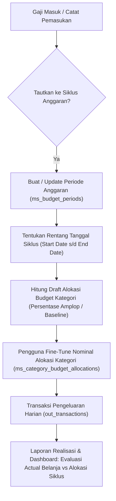

# PRD 07: Siklus Anggaran Dinamis & Estimasi Kategori Berbasis Tanggal Gajian (Pay Period Budgeting)

**Tanggal:** 2026-10-08  
**Nomor Dokumen:** 2026-10-08-07  
**Status:** DRAFT (PROPOSED)  
**Tautan Dokumen Terkait:**  
- [PRD 01 Planning Perubahan Konsep](2026-10-03-01-planning-perubahan-konsep.md)  
- [PRD 02 Master Data Refactoring (Kategori & Budget Groups)](2026-10-03-02-prd-master-kategori-dan-budget-groups.md)  
- [PRD 03 Modul Pemasukan](2026-10-03-03-prd-modul-pemasukan.md)  
- [PRD 04 Modul Pengeluaran](2026-10-04-prd-modul-pengeluaran.md)  
- [PRD 05 Modul Laporan & Dashboard](2026-10-03-05-prd-modul-laporan-dan-dashboard.md)  

---

## 1. Latar Belakang & Motivasi

Pada konsep sebelumnya (Tahap 1–6):
1. Nilai estimasi batas belanja disimpan langsung di master kategori (`ms_categories.monthly_estimate`) dengan nilai statis.
2. Evaluasi pengeluaran dan laporan realisasi anggaran dievaluasi kaku berdasarkan bulan kalender biasa (tanggal 1 s.d. 30/31).

### Permasalahan Nyata Pengguna:
- **Fluktuasi Pemasukan Pokok**: Pemasukan utama (misal: gaji bulanan) sering kali bervariasi (lembur, bonus, pemotongan, penyesuaian gaji). Nilai estimasi pos belanja seharusnya mengikuti besaran pendapatan riil pada siklus tersebut.
- **Siklus Gajian Bersifat Dinamis (Paycheck Cycle)**: Gajian biasanya jatuh pada tanggal 5 setiap bulan, namun bisa mundur atau maju karena akhir pekan, hari libur nasional, atau kebijakan operasional.
- **Ketidaksesuaian Periode Belanja**: Uang belanja harian pada tanggal 1 s.d. 4 pada dasarnya masih menggunakan sisa anggaran gaji bulan sebelumnya, bukan gaji bulan berjalan. Jika dibatasi kaku per bulan kalender biasa, batasan anggaran per kategori menjadi bias dan tidak mencerminkan daya belanja yang sebenarnya.

---

## 2. Solusi Konseptual: Paycheck-to-Paycheck Budgeting

Sistem diperluas untuk mendukung **Siklus Anggaran Dinamis (Budget Periods)**:
1. **Master Kategori (`ms_categories`)**:
   - Kolom `monthly_estimate` tetap dipertahankan namun beralih peran sebagai **Estimasi Default (Baseline Template)**.
2. **Entitas Siklus Anggaran (`ms_budget_periods`)**:
   - Mewakili satu rentang periode anggaran (contoh: *Periode Oktober 2026* dengan rentang `start_date: 2026-10-05` s/d `end_date: 2026-11-04`).
   - Fleksibel dan dapat diubah tanggal mulai/selesainya saat tanggal gajian aktual bergeser.
   - Menyimpan total pemasukan utama yang dialokasikan (`total_income_allocated`).
3. **Entitas Alokasi Anggaran Kategori per Siklus (`ms_category_budget_allocations`)**:
   - Menyimpan plafon nominal anggaran riil per kategori untuk periode bersangkutan (`allocated_amount`).
   - Dapat di-generate otomatis saat gaji diinput:
     - Berdasarkan persentase amplop `ms_budget_groups` (Need 50%, Fun 30%, Saving 20%) dan baseline category, ATAU
     - Menyalin (*copy-forward*) alokasi periode sebelumnya.
   - Pengguna memiliki kontrol penuh untuk mengubah (*fine-tune*) nilai nominal estimasi kategori pada periode aktif.
4. **Evaluasi Pengeluaran & Laporan Realisasi**:
   - Menghitung pengeluaran aktual dari `out_transactions` yang `transaction_date`-nya berada di dalam rentang `[start_date, end_date]` periode siklus tersebut.
   - Membandingkan actual belanja terhadap alokasi periode dinamis (`ms_category_budget_allocations.allocated_amount`).

---

## 3. Desain Model Data & Skema Database

### 3.1 File Migrasi Baru: `2026_10_08_090000_create_budget_periods_and_allocations_tables.php`

#### A. Tabel `ms_budget_periods`
Mencatat rentang siklus keuangan pengguna.
- `id` (bigint unsigned, PK)
- `user_id` (bigint unsigned, FK ke `users.id`, onDelete cascade)
- `name` (varchar 100) — contoh: `"Oktober 2026"`, `"Siklus 5 Okt - 4 Nov 2026"`
- `start_date` (date) — tanggal mulai siklus (hari gajian aktual)
- `end_date` (date) — tanggal akhir siklus (H-1 sebelum gajian berikutnya)
- `income_transaction_id` (bigint unsigned nullable, FK ke `in_transactions.id`, onDelete set null) — transaksi gaji pemicu
- `total_income_allocated` (decimal 15,2, default 0.00) — nominal dasar gaji yang dialokasikan
- `is_active` (boolean, default true) — penanda periode aktif
- `notes` (text, nullable)
- `created_at`, `updated_at` (timestamps)

Indeks & Integritas:
- `index(['user_id', 'start_date', 'end_date'])`
- `index(['user_id', 'is_active'])`

#### B. Tabel `ms_category_budget_allocations`
Mencatat jatah nominal kategori pada periode spesifik.
- `id` (bigint unsigned, PK)
- `user_id` (bigint unsigned, FK ke `users.id`, onDelete cascade)
- `budget_period_id` (bigint unsigned, FK ke `ms_budget_periods.id`, onDelete cascade)
- `category_id` (bigint unsigned, FK ke `ms_categories.id`, onDelete cascade)
- `allocated_amount` (decimal 15,2, default 0.00) — pagu/estimasi belanja kategori pada siklus ini
- `notes` (varchar 255, nullable)
- `created_at`, `updated_at` (timestamps)

Indeks & Integritas:
- `unique(['budget_period_id', 'category_id'])` — satu kategori hanya memiliki satu alokasi per siklus.

---

## 4. Alur Kerja (Workflow) Sistem



### Skenario Operasional:
1. **Tanggal Gajian Normal (misal 5 Okt 2026)**:
   - Pengguna mencatat transaksi pemasukan gaji Rp 10.000.000 pada tanggal 5 Oktober 2026.
   - Sistem menawarkan/membuat siklus anggaran: `5 Okt 2026` s/d `4 Nov 2026`.
   - Budget otomatis terdistribusi ke kategori pengeluaran dan dapat disesuaikan.
2. **Tanggal Gajian Bergeser (misal Gajian November mundur ke 7 Nov 2026)**:
   - Pengguna dengan mudah memperpanjang `end_date` siklus Oktober menjadi `6 Nov 2026`.
   - Transaksi pengeluaran tanggal 1–6 November otomatis tetap diperhitungkan ke dalam sisa pagu siklus Oktober.
   - Siklus November baru dimulai dari tanggal `7 Nov 2026`.

---

## 5. Spesifikasi Backend API

Semua endpoint dilindungi middleware `auth:sanctum` dan diisolasi per `user_id`.

### 5.1 Endpoint Siklus Anggaran (`/api/budget-periods`)
- `GET /api/budget-periods`:
  - List daftar periode milik user (sort by `start_date` descending).
  - Query params: `is_active`, `search`.
- `POST /api/budget-periods`:
  - Membuat siklus baru, menetapkan rentang tanggal `start_date` & `end_date`.
  - Body:
    ```json
    {
      "name": "Oktober 2026",
      "start_date": "2026-10-05",
      "end_date": "2026-11-04",
      "income_transaction_id": 12,
      "total_income_allocated": 10000000,
      "copy_from_period_id": null,
      "auto_generate_allocations": true
    }
    ```
- `GET /api/budget-periods/{id}`:
  - Mengambil detail periode beserta daftar `allocations` per kategori dan grup anggaran.
- `PUT /api/budget-periods/{id}`:
  - Mengubah informasi periode, tanggal cut-off, atau catatan.
- `DELETE /api/budget-periods/{id}`:
  - Menghapus siklus (cascade allocations).

### 5.2 Endpoint Alokasi Anggaran (`/api/budget-periods/{id}/allocations`)
- `GET /api/budget-periods/{id}/allocations`:
  - Daftar alokasi kategori untuk periode tersebut (join kategori & budget group).
- `PUT /api/budget-periods/{id}/allocations`:
  - Melakukan update massal (*batch update*) alokasi nominal kategori:
    ```json
    {
      "allocations": [
        { "category_id": 1, "allocated_amount": 2500000 },
        { "category_id": 2, "allocated_amount": 500000 }
      ]
    }
    ```

### 5.3 Pembaruan Layanan Laporan & Dashboard (`ReportService`)
- Menambahkan parameter opsi `period_id` pada:
  - `GET /api/reports/budget-comparison?period_id=...` (jika `period_id` disediakan, perbandingan mengacu pada rentang tanggal siklus dan alokasi `ms_category_budget_allocations`).
  - Tetap menyediakan fallback berbasis bulan kalender `?month=YYYY-MM` demi backward compatibility.
- Dashboard menampilkan status pagu siklus anggaran yang sedang aktif.

---

## 6. Spesifikasi Frontend UI/UX

### 6.1 Menu Navigasi Baru / Modifikasi
- Menu **Master -> Alokasi Anggaran** (`/master/budget-groups`) diperluas atau dilengkapi menu/tab **Kelola Siklus Anggaran & Alokasi** (`/master/budget-periods`).
- Atau opsi yang lebih intuitif: Form khusus **"Kelola Anggaran Siklus Ini"** langsung dapat diakses dari Dashboard dan Laporan Realisasi Anggaran.

### 6.2 Antarmuka Kelola Periode & Alokasi
- **Seleksi Periode**: Dropdown pemilih periode aktif (*contoh: "Siklus 5 Okt - 4 Nov 2026"*).
- **Pengaturan Tanggal Fleksibel**: Tombol "Ubah Tanggal Siklus" (memungkinkan geser tanggal saat gajian mundur).
- **Tabel Alokasi Kategori**:
  - Kolom: Nama Kategori, Kelompok Amplop, Estimasi Default (Baseline), **Alokasi Siklus Ini (Editable)**, Aktual Terpakai, Sisa Budget.
  - Terdapat bar akumulasi: *Total Gaji Dialokasikan*, *Total Anggaran Terbagi*, *Sisa Belum Dialokasikan*.

### 6.3 Halaman Laporan Realisasi Anggaran (`BudgetComparisonReport`)
- Filter atas menyediakan toggle:
  - Pilihan **Berdasarkan Siklus Gajian (Pay Period)** [Default]
  - Pilihan **Berdasarkan Bulan Kalender Standar (1–31)**

---

## 7. Rencana Tahapan Eksekusi

```text
├── Tahap 7.1: Persiapan Skema & Migrasi Database
│   ├── Migrasi ms_budget_periods & ms_category_budget_allocations
│   └── Model Eloquent BudgetPeriod & CategoryBudgetAllocation
│
├── Tahap 7.2: Layanan Backend & RESTful API
│   ├── Controller BudgetPeriodController & Allocation Controller
│   ├── Refactor ReportService untuk mendukung rentang tanggal periode
│   └── PHPUnit Feature Tests
│
├── Tahap 7.3: Frontend Implementation
│   ├── Halaman / Komponen Kelola Periode Anggaran & Alokasi
│   ├── Integrasi Selector Periode pada Laporan Realisasi Anggaran
│   └── Pembaruan Widget Dashboard Ringkasan Pagu Periode
│
└── Tahap 7.4: Verifikasi & QA
    ├── Pengujian siklus gajian bergeser / mundur
    ├── Linting & Vite Production Build
    └── Pembaruan Dokumentasi (agent.md & manual book)
```

---

## 8. Kriteria Penerimaan (Acceptance Criteria)

1. Pengguna dapat membuat periode anggaran baru dengan rentang tanggal fleksibel (misal: 5 Okt s/d 4 Nov).
2. Pengguna dapat mengubah `end_date` siklus jika tanggal gajian bulan berikutnya mundur.
3. Nilai estimasi anggaran kategori dapat ditentukan secara dinamis per periode dan tidak mengunci statis ke seluruh bulan.
4. Laporan Realisasi Anggaran secara akurat menghitung total pengeluaran transaksi dalam rentang tanggal siklus tersebut terhadap plafon yang dialokasikan.
5. Seluruh feature test PHPUnit backend lulus tanpa regresi dan frontend lulus build Vite.

